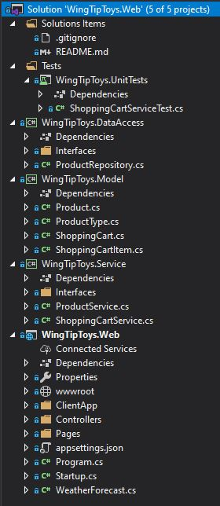

# WingTip Toys Product Catalog

Sample Angular .NET Core Web Application created with Visual Studio Community 2019, Version 16.5.4

Motivation for using Angular with a .NET Core API backend comes from the quick scaffolding of a web application that is both scalable and reliable (in my humble opinion). 

Angular in particular, an opensource JavaScript framework designed for building dynamic web applications, uses pure HTML as its template language, but allows us to extend HTML’s syntax and combine it with functionality to build higher-level components. The TypeScript language, support for dependency injection, lazy loading modules, two-way data binding and organizing your application with components are some of the benefits developers can take advantage of.

## Prerequisites:
- Visual Studio 2019
- Visual Studio Code (optional for developing the ClientApp)
- .NET Core 3.1 (https://dotnet.microsoft.com/download/dotnet-core/3.1)
- Node.js (https://nodejs.org/en/)
- Angular installed (in command prompt run this statement: `npm install -g @angular/cli`)

## Local development
To run this locally:
- Clone this repository.
- Open `WingTipToys.Web.sln` in the root folder wtih Visual Studio 2019.
- Run with `IIS Express` or select `WingTipToys.Web` in the run dropdown and run by hitting the play button or `F5`!
  - NOTE: on first run it may take a minute or so as the solution will install project dependencies.

## Overview of solution
The solution was organized to help with separation of concerns. A few things I would address next would be to create DTO models within the Web project to de-couple the web models from the backend API models.  Additionally, I would also create entity models that would represent the database within the DataAccess project.

- **Models** is responsible for defining the data models that may be used in the various projects of the solution.
- **DataAccess** is responsible for any CRUD operation with the data.
- **Service** is responsible for handling of the data between the API endpoints and the DataAccess.
- **Web** is responsible for providing access to the resources the `ClientApp` may require.

## Quick demo of running the solution and the unit tests

